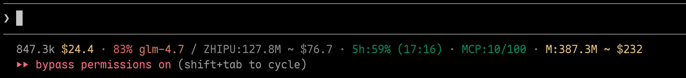

[中文](README.zh-CN.md) | [日本語](README.ja.md) | [Français](README.fr.md) | [Español](README.es.md)

# cc-costline

Enhanced statusline for [Claude Code](https://docs.anthropic.com/en/docs/claude-code) — adds cost tracking, usage limits, Zhipu GLM usage, and leaderboard rank to your terminal.



```
526.3k $16.3 · 57% glm-4.7 / 7d:$137 / ZHIPU:124.0M ~ $74.4 · 5h:27% · MCP:10/100 · M:380.5M ~ $228
```

## Install

```bash
npm i -g cc-costline && cc-costline install
```

Open a new Claude Code session and you'll see the enhanced statusline. Requires Node.js >= 22.

## What you get

| Segment | Example | Description |
|---------|---------|-------------|
| Tokens ~ Cost / Context | `526.3k ~ $16.3 / 57% glm-4.7` | Session token count, cost, context usage, and model |
| Usage limits | `5h: 27%` | Claude 5-hour utilization (auto-colored like context) |
| Period cost | `7d: $137` or `30d: $246` | Local rolling cost (configurable: none/7d/30d/both) |
| Zhipu GLM usage | `ZHIPU:124.0M ~ $74.4 · 5h:27% · MCP:10/100 · M:380.5M ~ $228` | 24h usage, 5h quota, MCP monthly, month-to-date |
| Leaderboard | `#2/22 $67.0` | [ccclub](https://github.com/mazzzystar/ccclub) rank (if installed) |

### Zhipu GLM usage details

| Display | Example | Description |
|---------|---------|-------------|
| 24h model usage | `ZHIPU:124.0M ~ $74.4` | 24-hour Token total and estimated cost |
| 5h quota | `5h:27%` or `5h:2:30` | 5-hour Token utilization, shows countdown when ≥100% |
| MCP monthly | `MCP:10/100` | MCP tool monthly calls (search-prime + web-reader + zread) |
| Month-to-date | `M:380.5M ~ $228` | Cumulative usage from 1st to today |

### Statusline examples

#### Default (period=7d, showResetTime=false)
```
526.3k $16.3 · 57% glm-4.7 / 7d:$137 / ZHIPU:124.0M ~ $74.4 · 5h:27% · MCP:10/100 · M:380.5M ~ $228
```

#### Minimal (period=none, showZhipu=false)
```
526.3k $16.3 · 57% glm-4.7 / 5h:27%
```

#### Full (period=both, showResetTime=true)
```
526.3k $16.3 · 57% glm-4.7 / 7d:$137 · 30d:$246 / ZHIPU:124.0M ~ $74.4 · 5h:27% (17:16) · MCP:10/100 · M:380.5M ~ $228
```

#### Quota exceeded (5h > 100%)
```
526.3k $16.3 · 57% glm-4.7 / ZHIPU:124.0M ~ $74.4 · 5h:2:30 · MCP:10/100 · M:380.5M ~ $228
```
→ `5h:2:30` shows countdown to refresh (2h 30m remaining)

### Colors

- **Context & usage limits** — green (< 60%) → orange (60-79%) → red (≥ 80%)
- **Leaderboard rank** — #1 gold, #2 white, #3 orange, others blue
- **Period cost** — yellow

### Optional integrations

- **Claude usage limits** — reads OAuth credentials from macOS Keychain automatically. Just `claude login` and it works.
- **Zhipu GLM usage** — reads `ANTHROPIC_AUTH_TOKEN` and `ANTHROPIC_BASE_URL` from `~/.claude/settings.json` (Zhipu-compatible config).
- **ccclub leaderboard** — install [ccclub](https://github.com/mazzzystar/ccclub) (`npm i -g ccclub && ccclub init`). Rank appears automatically.

All are zero-config: if not available, the segment is silently omitted.

## Commands

```bash
cc-costline install              # Set up Claude Code integration
cc-costline uninstall            # Remove from settings
cc-costline refresh              # Manually recalculate cost cache

# Configure display period
cc-costline config --period none   # Hide 7d/30d cost
cc-costline config --period 7d     # Show 7-day cost only
cc-costline config --period 30d    # Show 30-day cost only
cc-costline config --period both   # Show both 7d and 30d

# Zhipu usage configuration
cc-costline config --zhipu true    # Show Zhipu usage (default)
cc-costline config --zhipu false   # Hide Zhipu usage
cc-costline config --reset-time true   # Show 5h quota reset time
cc-costline config --reset-time false  # Hide reset time (default)
```

## How it works

1. **install** configures `~/.claude/settings.json` — sets the statusline command and adds session-end hooks for auto-refresh. Your existing settings are preserved.
2. **render** reads Claude Code's stdin JSON and the cost cache, outputs the formatted statusline.
3. **refresh** scans `~/.claude/projects/**/*.jsonl`, extracts token usage, applies per-model pricing, and writes to `~/.cc-costline/cache.json`.
4. **Claude usage** is fetched from `api.anthropic.com/api/oauth/usage` with a 60s file cache at `/tmp/sl-claude-usage`.
5. **Zhipu GLM usage** is fetched from Zhipu APIs (`/api/monitor/usage/model-usage`, `/api/monitor/usage/quota/limit`) with a 60s file cache at `/tmp/sl-zhipu-usage`.
6. **ccclub rank** is fetched from `ccclub.dev/api/rank` with a 120s file cache at `/tmp/sl-ccclub-rank`.

<details>
<summary>Claude model pricing</summary>

Prices per million tokens (USD):

| Model | Input | Output | Cache Write | Cache Read |
|-------|------:|-------:|------------:|-----------:|
| Opus 4.6 | $5 | $25 | $6.25 | $0.50 |
| Opus 4.5 | $5 | $25 | $6.25 | $0.50 |
| Opus 4.1 | $15 | $75 | $18.75 | $1.50 |
| Sonnet 4.5 | $3 | $15 | $3.75 | $0.30 |
| Sonnet 4 | $3 | $15 | $3.75 | $0.30 |
| Haiku 4.5 | $1 | $5 | $1.25 | $0.10 |
| Haiku 3.5 | $0.80 | $4 | $1.00 | $0.08 |

Unknown models fall back by family name, defaulting to Sonnet pricing.

</details>

<details>
<summary>Zhipu GLM model pricing</summary>

Prices per million tokens (USD), sourced from [LiteLLM](https://github.com/BerriAI/litellm):

| Model | Input | Output | Cache Read |
|-------|------:|-------:|-----------:|
| zai/glm-4.7 | $0.60 | $2.20 | $0.11 |
| zai/glm-4.6 | $0.60 | $2.20 | $0.11 |
| zai/glm-4.5-air | $0.20 | $1.10 | - |
| zai/glm-5 | $1.00 | $3.20 | $0.20 |

**Note**: Cost calculation uses input price uniformly ($0.60/M), no distinction between input/output tokens.

</details>

## Development

```bash
npm test    # Build + run unit tests (node:test, zero dependencies)
```

## Uninstall

```bash
cc-costline uninstall
npm uninstall -g cc-costline
```

## Acknowledgments

- [ccclub](https://github.com/mazzzystar/ccclub) by 碎瓜 ([@mazzzystar](https://github.com/mazzzystar)) — Claude Code leaderboard among friends
- [LiteLLM](https://github.com/BerriAI/litellm) — Unified model pricing database
- [Zhipu AI](https://open.bigmodel.cn/) — GLM model service

## License

MIT
